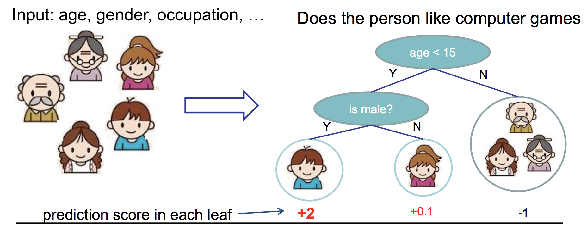
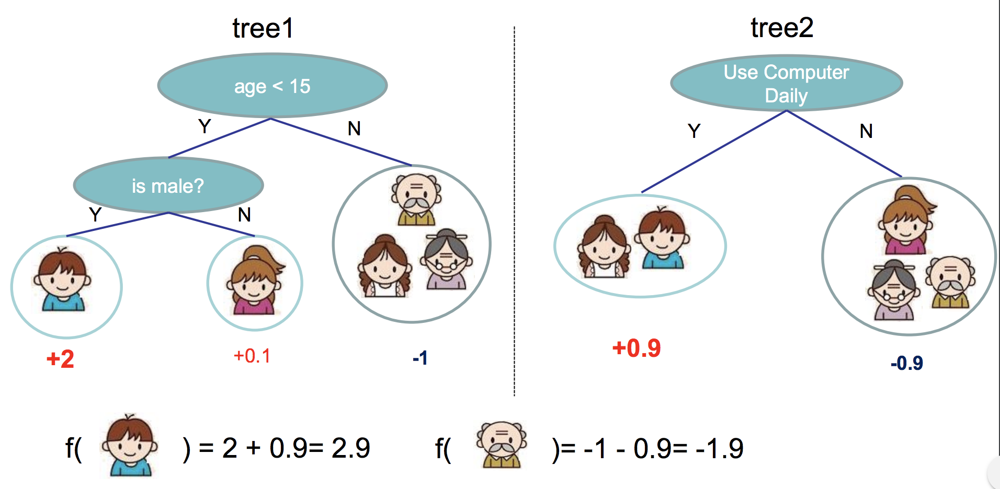

```{r setup, include=FALSE}
knitr::opts_chunk$set(message = FALSE, warning = FALSE)
pkgs <- c("stringr", "xgboost", "dplyr", "ggplot2", "DiagrammeR", "Ckmeans.1d.dp")
for (i in 1:length(pkgs)){
    if (! pkgs[i] %in% installed.packages()){
        install.packages(pkgs[i], dependencies = TRUE,
                         repos = "https://cloud.r-project.org")
    }
}

library(xgboost)
library(dplyr)
library(ggplot2)
library(DiagrammeR)
library(Ckmeans.1d.dp)
```

## Outline
- Supervised learning and loss function
- Tree method and ensemble
- Gradient boosting
- Extreme gradient boosting
- `xgboost` R package

## Supervised Learning

- Regression: Linear regression -- square error loss
$$l(y_i,\widehat{y})=(y_i-\widehat{y}_i)^2$$
- Classification: Logistic regression -- logistic loss
$$l(y_i,\widehat{y}_i)=y_i\log(1+e^{-\widehat{y}_i})+(1-y_i)\log(1+e^{\widehat{y}_i})$$
- Loss on training data: $L=\sum_{i=1}^n l(y_i,\widehat{y}_i)$
- Regularization: Bias-variance trade-off

## Additive Training (Boosting)
- Convert a set of weak learners to a single strong learner. 
- Start from a constant prediction, add a new learner each time. 
\begin{align*}
\widehat{y}_i^{(0)} &=C \\
\widehat{y}_i^{(1)} &=C+f_1(x_i)=\widehat{y}_i^{(0)}+f_1(x_i) \\
\widehat{y}_i^{(2)} &=C+f_1(x_i)+f_2(x_i)=\widehat{y}_i^{(1)}+f_2(x_i) \\
&\cdots \\
\widehat{y}_i^{(t)} &=C+\sum_{k=1}^t f_t(x_i)=\widehat{y}_i^{(t-1)}+f_t(x_i)
\end{align*}

## Example: Ensemble Classification Trees
```{r, out.width = "1000px", echo=FALSE}

```

## Example: Ensemble Classification Trees
```{r, out.width = "1000px", echo=FALSE}

```

## Gradient Boosting Tree (Friedman) 
1. Initialize a constant value model $f_0$. 
2. For $t=1$ to $T$, do 
- Compute the gradient (pseudo-residuals)
$$\widetilde{y}_i=\left.\frac{\partial}{\partial\widehat{y}_i} l(y_i,\widehat{y}_i)\right\vert_{\widehat{y}_i=\widehat{y}_i^{(t-1)}}$$
- Fit a tree $h_t$ to the gradients. 
- Line search to find the step size $\epsilon_t$
$$\epsilon_t=\arg\min_\epsilon\sum_{i=1}^n l(y_i,\widehat{y}_i^{(t-1)}+\epsilon h_t(x_i))$$
- Update the additive model using $f_t(x)=\epsilon_t h_t(x)$

## Extreme Gradient Boosting (Chen)
- At round $t$, the objective function to minimize
$$Obj^{(t)}=\sum_{i=1}^n l(y_i,\widehat{y}_i^{(t)})+\Omega(f_t)=\sum_{i=1}^n l(y_i,\widehat{y}_i^{(t-1)}+f_t(x_i))+\Omega(f_t)$$
- Second-order Taylor Expansion at $\widehat{y}^{(t-1)}$
\begin{align*}
Obj^{(t)}&\approx \sum_{i=1}^n \left(l(y_i,\widehat{y}_i^{(t-1)})+g_if_t(x_i)+\frac{1}{2}h_if_t(x_i)^2\right)+\Omega(f_t) \\
&=\sum_{i=1}^n \left(g_if_t(x_i)+\frac{1}{2}h_if_t(x_i)^2\right)+\Omega(f_t)+Constant
\end{align*}

## XGBoost
- Base learner: regression tree $f_t(x)=w_{q(x)}$, piece-wise constant
- Define tree complexity
$$\Omega(f_t)=\gamma|T|+\frac{1}{2}\lambda\sum_{j=1}^{|T|}w_j^2$$
- Regroup the objective
\begin{align*}
Obj^{(t)}&\approx \sum_{i=1}^n \left(g_if_t(x_i)+\frac{1}{2}h_if_t(x_i)^2\right)+\Omega(f_t) \\
&= \sum_{i=1}^n \left(g_i w_{q(x_i)}+\frac{1}{2}h_i w_{q(x_i)}^2\right)+\gamma|T|+\frac{1}{2}\lambda\sum_{j=1}^{|T|}w_j^2 \\
&= \sum_{j=1}^{|T|} \left[\left(\sum_{i\in I_j} g_i\right)w_j+\frac{1}{2}\left(\sum_{i\in I_j} h_i+\lambda\right)w_j^2\right]+\gamma|T|
\end{align*}

## XGBoost Continued
$$Obj^{(t)}\approx \sum_{j=1}^{|T|} \left[G_jw_j+\frac{1}{2}\left(H_j+\lambda\right)w_j^2\right]+\gamma|T|$$

- If the tree structure is determined, $w_j^*=-\frac{G_j}{H_j+\lambda}$. We only need to find a tree structure to minimize 
$$Obj^{(t)}\approx -\frac{1}{2}\sum_{j=1}^{|T|} \frac{G_j^2}{H_j+\lambda}+\gamma|T|$$

## Searching Algorithm
- Enumerate the possible tree structures: N-P hard
- Greedy search
$$\text{Gain}=\frac{G_L^2}{H_L+\lambda}+\frac{G_R^2}{H_R+\lambda}-\frac{(G_L+G_R)^2}{H_L+H_R+\lambda}-\gamma$$
- Handling missing values: When using a feature with missing values to do splitting, `xgboost` will assign a direction to the missing values instead of a numerical value. Specifically, xgboost guides the data points with missing values to the left and right respectively, then choose the direction with a higher gain with regard to the objective. 

## More about XGBoost
- Post-pruning: Grow a tree to maximum depth, recursively prune splits with negative gain. 
- Row subsampling; Column subsampling (random forest)
- Learning rate: step size $\widehat{y}^{(t)}=\widehat{y}^{(t-1)}+\epsilon f_t(x)$  
This means we do not do full optimization in each step and reserve chance for future rounds. It helps prevent overfitting. 
- Customize your own loss function. 
- Linear booster

## `xgboost` R Package
`xgboost(data = NULL, label = NULL, missing = NA,`  
&nbsp; &nbsp; &nbsp; &nbsp; &nbsp; &nbsp; &nbsp; &nbsp; &nbsp; `weight = NULL, params = list(), nrounds, ...)`

- `data`   
dense Matrix: i.e. matrix ;   
sparse Matrix: i.e. Matrix::dgCMatrix ;  
xgb.DMatrix: its own class (recommended).
- `booster` [default=gbtree]  
which booster to use, can be "gbtree", "gblinear" or "dart". 
- `objective` [default=reg:linear]  
“reg:linear”, “reg:logistic”, “binary:logistic”, “count:poisson”, “survival:cox”, “multi:softmax”, “multi:softprob”
- `nrounds`  
- `eta` [default=0.3, alias: learning_rate]  
- `gamma` [default=0, alias: min_split_loss]

## `xgboost` R Package
`xgboost(data = NULL, label = NULL, missing = NA, `  
&nbsp; &nbsp; &nbsp; &nbsp; &nbsp; &nbsp; &nbsp; &nbsp; &nbsp; `weight = NULL, params = list(), nrounds, ...)`

- `max_depth` [default=6]
- `subsample` [default=1]
- `colsample_bytree` [default=1]
- `colsample_bylevel` [default=1]
- `lambda` [default=1, alias: reg_lambda]
- `alpha` [default=0, alias: reg_alpha]  
L1 regularization term

## Example 1: Iris Data (Multi-class Classification)
``` {r warning=FALSE}
df <- iris
str(df)

X <- as.matrix(df[,-5])
Y <- as.numeric(df[,5]) - 1
dtrain <- xgb.DMatrix(data = X, label = Y)
```

## Example 1
``` {r}
library(xgboost)
xgbtree1 <- xgboost(data = dtrain, objective = "multi:softmax", 
                   nrounds = 20, max.depth = 3, num_class = 3, eta = 0.2)
```

## Example 1
``` {r}
pred1 <- predict(xgbtree1, X)
head(pred1)     # class labels
```
``` {r}
xgbtree2 <- xgboost(data = dtrain, objective = "multi:softprob", 
                   nrounds = 20, max.depth = 3, num_class = 3, eta = 0.2, 
                   verbose = 0)
pred2 <- predict(xgbtree2, X)
head(matrix(pred2, ncol = 3, byrow = TRUE))    # class probabilities
```

## Example 1
``` {r}
tree <- xgb.dump(xgbtree2, with_stats = TRUE)
tree[1:14]    # check the first two trees
```

## Example 1
``` {r}
xgb.plot.tree(feature_names = dimnames(dtrain)[[2]], model = xgbtree2, 
              n_first_tree = 1, plot_width = 1000, plot_height = 500)
```

## Example 1
```{r fig.height=5, fig.width=9}
importance <- xgb.importance(feature_names = dimnames(dtrain)[[2]], 
                             model = xgbtree2)
xgb.ggplot.importance(importance) + theme(legend.position="none")
```

## Example 1
``` {r}
xgb.save(xgbtree2, "xgbtree.model")     # save the final model
xgbtree3 <- xgb.load("xgbtree.model")   # load the saved model 
```

## Tuning: Cross Validation
`xgb.cv(..., nfold, metrics = list(), `  
&nbsp; &nbsp; &nbsp; &nbsp; &nbsp; &nbsp; &nbsp; &nbsp;  `early_stopping_rounds = NULL, ...)`

- `nfold`
- `metrics`  
Evaluation metrics for validation data, a default metric will be assigned according to objective.  
- `early_stopping_rounds`  
If the performance is not getting better for this number of steps, the program will stop. 

## Tuning: Validation Set
`xgboost(data = NULL, label = NULL, missing = NA, `  
&nbsp; &nbsp; &nbsp; &nbsp; &nbsp; &nbsp; &nbsp; &nbsp; &nbsp; `weight = NULL, params = list(), nrounds, ...)`

- `watchlist`  
It is a list of `xgb.DMatrix` objects, each of them tagged with a name.

## Example 2: [UCI Adult](https://archive.ics.uci.edu/ml/datasets/Adult) (Binary Classification)

## Reference and Resources
- Tianqi Chen & Carlos Guestrin (2016). [XGBoost: A Scalable Tree Boosting System.](https://arxiv.org/pdf/1603.02754.pdf) CoRR, abs/1603.02754, .
- Friedman, J. (2001). [Greedy Function Approximation: A Gradient Boosting Machine.](https://www.jstor.org/stable/pdf/2699986.pdf?refreqid=excelsior%3A9b4f8c3edcdcb9ede6af5fa18a36f978) The Annals of Statistics, 29(5), 1189-1232. 
- [Introduction to Boosted Trees,](https://homes.cs.washington.edu/~tqchen/pdf/BoostedTree.pdf) Tianqi Chen, homes.cs.washington.edu/~tqchen/pdf/BoostedTree.pdf.
- [Awesome XGBoost](https://github.com/dmlc/xgboost/tree/master/demo)
- [XGBoost R Tutorial](http://xgboost.readthedocs.io/en/latest/R-package/xgboostPresentation.html)
- [Introduction to Parameters](https://xgboost.readthedocs.io/en/latest/parameter.html)
- [The Github Repository of XGBoost](https://github.com/dmlc/xgboost)


